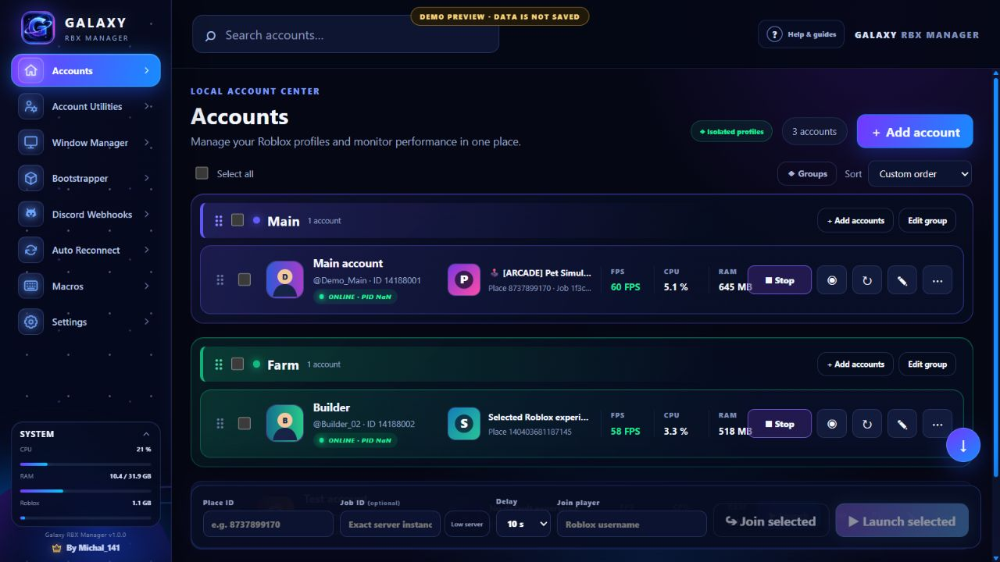
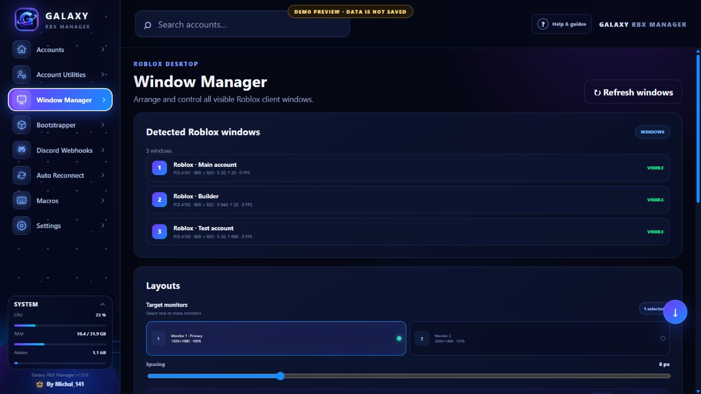
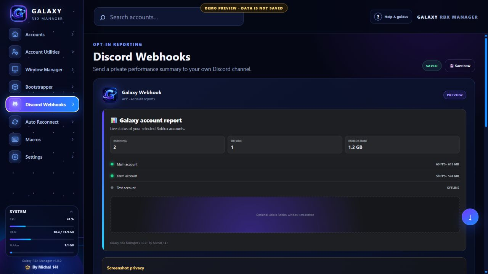
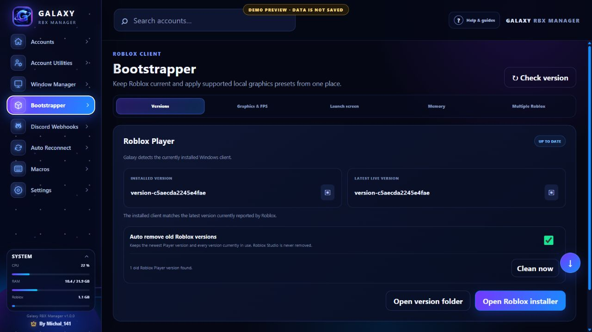

<div align="center">


# Galaxy RBX Manager

### A local-first Windows dashboard for your own Roblox accounts.

Launch isolated sessions, arrange clients, watch performance, receive Discord reports, and keep multi-account setups under control from one place.

[](../../releases)


[](https://discord.com/users/1432824410170982402)

[Features](#features) · [Screenshots](#screenshots) · [Download](#download) · [Security](#security--privacy) · [Help](#help--contact)

</div>

> [!IMPORTANT]
> Galaxy RBX Manager is in active development. Use it only with Roblox accounts you own. It is an independent community project and is not affiliated with, endorsed by, or sponsored by Roblox Corporation.

## One dashboard, every client

Galaxy keeps each Roblox website login in its own persistent Electron partition and maps every launched Player process back to the correct local account. The manager is designed for a clear overview even when many clients are running at once.

| Account control | Performance and recovery |
| --- | --- |
| Isolated Roblox browser profiles | Per-client FPS, CPU, RAM, and uptime |
| Sequential multi-account launching | Window layouts across multiple monitors |
| Groups, search, sorting, and drag ordering | Log-based Auto Reconnect with loop protection |
| Exact Job ID, Join player, and Low server launch | Scheduled Memory Optimizer and ghost-client cleanup |

## Features

<table>
<tr>
<td width="50%" valign="top">

### Account Center

- Add accounts through the real Roblox login page or protected cookie import.
- Keep every session isolated and persistent.
- Launch selected profiles gradually with saved Place ID, Job ID, delay, or player target.
- Organize accounts into colored, reorderable groups.

</td>
<td width="50%" valign="top">

### Window Manager

- Detect and control visible Roblox windows.
- Tile clients horizontally, vertically, or into a grid.
- Target one or several monitors and save reusable layouts.
- Optional click-through FPS badges follow the exact client window.

</td>
</tr>
<tr>
<td width="50%" valign="top">

### Bootstrapper

- Detect the installed and current Roblox Player versions.
- Apply supported global graphics presets and a custom FPS cap.
- Clean obsolete Player versions without touching Roblox Studio.
- Optional launch appearance and high-RAM Memory Optimizer.

</td>
<td width="50%" valign="top">

### Automation and reports

- Discord Webhooks with selected accounts, metrics, events, and screenshot collages.
- Auto Reconnect driven by Roblox logs with retry limits.
- Foreground-safe per-account macros and fixed randomized Anti-AFK.
- Local activity console showing what the manager is doing.

</td>
</tr>
</table>

## Screenshots

### Account Center



| Window Manager | Discord Webhooks |
| --- | --- |
|  |  |

### Bootstrapper



> All screenshots use Galaxy's built-in demo preview. No real Roblox session, cookie, webhook URL, or personal account data is shown.

## Download

[**Open the latest GitHub Release →**](../../releases/latest)

| Platform | Architecture | Package |
| :---: | :---: | :---: |
| Windows 10 / 11 | x64 | Portable `.exe` |

1. Download the newest `Galaxy-RBX-Manager-*-Portable.exe` from Releases.
2. Keep the EXE in its own folder and open it normally.
3. Add an account and sign in on the real `roblox.com` page opened by Galaxy.
4. Start Galaxy before launching multiple Roblox clients.

Windows may show a SmartScreen warning while public code signing is not configured. Always download Galaxy from this repository's official Releases page.

## Updates

Galaxy checks the repository's latest stable Release shortly after startup. When a newer semantic version exists, the centered update window shows the installed and available versions.

- The reminder can be closed with **×** or **Remind me in 30 minutes**.
- It returns every 30 minutes while the older version is still running.
- A portable build opens the trusted GitHub Release for manual replacement.
- Once the installed version matches the latest Release, the reminder stops.
- Published releases remain available until the repository owner deletes them.
- Galaxy also compares GitHub's SHA-256 Release asset digest with the running portable EXE, so replacing the uploaded portable file can trigger an update even when its version number stays the same.

For example, `v1.0.0` will offer `v1.0.1`. Merely downloading the new EXE does not modify the running `v1.0.0`; start or replace it with `v1.0.1` to complete the update.

See [GITHUB-SETUP.md](GITHUB-SETUP.md) for repository connection and release instructions.

## Security & privacy

- Passwords are entered only on Roblox's own website.
- Session cookies are never displayed, logged, copied, or exported by Galaxy.
- Electron cookie encryption is enabled in packaged builds.
- Stored credentials and Discord webhook URLs use Electron `safeStorage`, backed by Windows DPAPI for the current Windows user.
- The renderer has no direct Node.js or filesystem access.
- Account data stays on the local computer and is not sent to a Galaxy server.
- Screenshot reports capture selected visible Roblox windows only, never the desktop.

<details>
<summary><strong>Where are local settings stored?</strong></summary>

Open **Settings → Data folder** inside Galaxy. Macro exports default to `Documents\Galaxy RBX Manager\Macro Exports`.

</details>

<details>
<summary><strong>Why can FPS show 0?</strong></summary>

Per-process FPS uses the official PresentMon console adapter. Some Windows accounts require one-time membership in the built-in Performance Log Users group followed by Windows sign-out.

</details>

<details>
<summary><strong>Does Auto Reconnect always work?</strong></summary>

No automated reconnect can be guaranteed. Galaxy watches Roblox logs for supported disconnect signals and limits retries to avoid reconnect loops, but server restrictions, moderation kicks, outages, and changed Roblox behavior can still require manual action.

</details>

## Development

```powershell
npm.cmd install
npm.cmd run check
npm.cmd test
npm.cmd start
```

To open the safe demo without Electron:

```powershell
npm.cmd run preview
```

Then visit `http://127.0.0.1:4173/?preview=1`. Demo data is not saved and Roblox is not launched.

## Help & contact

- Found a bug? Open a GitHub Issue and include the relevant Activity Console entry with secrets removed.
- Have an idea? Start a GitHub Discussion or feature request.
- Creator: [**Michal_141 on Discord**](https://discord.com/users/1432824410170982402)

<div align="center">

Made with 💜 by [Michal_141](https://discord.com/users/1432824410170982402)

</div>
